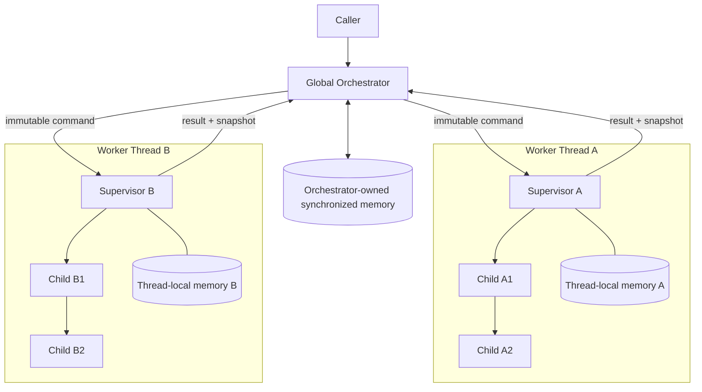
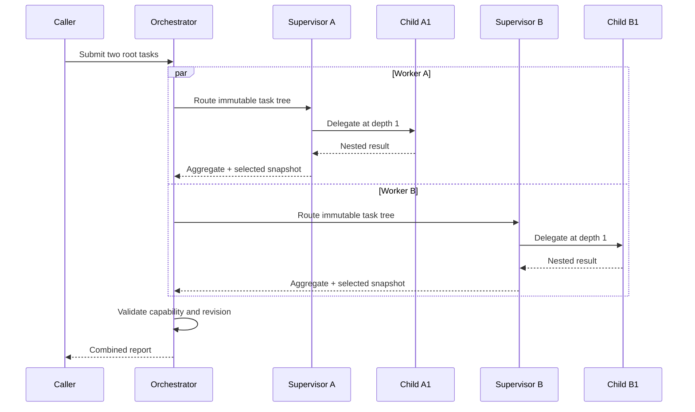

# Cross-Thread Multi-Agent Orchestration with Nested Sub-Agent Delegation

**Cross-Thread Multi-Agent Orchestration with Nested Sub-Agent Delegation
(CTMAO-NSD)** is the canonical name used by this repository for one unified
concurrency architecture. It combines isolated, thread-owned agent runtimes
with bounded hierarchical task delegation and orchestrator-mediated state
exchange.

This repository is a standard-library-only reference implementation for
architecture research, concurrency experiments, and teaching. It demonstrates
the control plane and safety boundaries without depending on LangGraph, CrewAI,
AutoGen, Swarm, Semantic Kernel, or another orchestration SDK.

## Relationship to the AI Product Framework

This repository is the standalone execution-engine reference. The sibling **AI
Product Framework** governs discovery, architecture selection, approval gates,
implementation, verification, deployment, and retrospectives. It may select
CTMAO-NSD when a product genuinely needs isolated concurrent agent runtimes, but
the two repositories remain independent:

- the AI Product Framework has no runtime dependency on this Python package;
- CTMAO-NSD does not embed product-specific workflows or framework policy; and
- consuming products integrate through adapters while preserving the engine's
  thread-ownership, delegation, and synchronization invariants.

> CTMAO-NSD is not a distributed consensus protocol, process sandbox, durable
> workflow engine, or claim of secure memory isolation. Python threads share a
> process; isolation here means enforced ownership and message boundaries.

## Architectural pattern

CTMAO-NSD is a concurrency architecture in which multiple isolated worker
threads each own a supervisor agent, an asynchronous runtime, and thread-local
state; supervisors decompose work into bounded parent-child delegation trees;
and all permitted state exchange between threads is mediated by a global
orchestrator through immutable messages and controlled synchronization.

The pattern has two inseparable mechanisms:

- **Cross-Thread Multi-Agent Orchestration** governs worker lifecycle, routing,
  scheduling, correlation, failure boundaries, capability-token passing, and
  selected state transfer between isolated runtimes.
- **Nested Sub-Agent Delegation** governs hierarchical decomposition,
  supervisor-child routing, recursive execution, ancestry checks, depth and
  fan-out limits, timeout propagation, and deterministic result aggregation.

They are complementary responsibilities within one architecture—not competing
architectures.

### Architectural invariants

1. A worker thread owns its event loop, supervisor, child agents, and mutable
   local memory.
2. Workers never hold references to one another and never mutate another
   worker's state.
3. Cross-thread commands and results use immutable dataclass envelopes.
4. Selected memory crosses a worker boundary only as an allowlisted snapshot
   authorized by a single-use synchronization capability.
5. The orchestrator is the sole owner of synchronized memory.
6. The root supervisor is delegation depth `0`; a child at the configured
   maximum depth is allowed, but another child below it is rejected.
7. Depth and direct-child limits are validated before a child branch is
   scheduled.
8. One absolute deadline is inherited by the entire delegation tree.
9. Results and failures propagate upward and retain worker, task, and agent-path
   identity.

## Execution model



The arrows are logical message paths. They do not represent direct mutation of
another worker's memory.



The orchestrator creates the main event-loop inbox. Each non-daemon worker
thread creates and closes its own `asyncio` event loop and all loop-bound
resources inside that thread. Transfer between loops uses
`call_soon_threadsafe`; no event loop consumes an `asyncio` primitive owned by a
different loop.

## Core concepts

### Global orchestrator

`Orchestrator` accepts root assignments, issues correlation IDs and
synchronization capabilities, routes commands, collects results, publishes
approved snapshots, and coordinates bounded shutdown. It does not execute child
work or expose worker-local mutable state.

### Worker runtime and supervisor agent

`WorkerThread` owns one OS thread and one event loop. The supervisor inside that
runtime is the only root-routing authority. It validates the root fan-out,
creates child contexts once, and aggregates results in declared order.

### Child agents and delegation contexts

`ChildAgent` executes a node and may recursively delegate its declared children.
Every child inherits immutable lineage, agent path, policy, and the root's
absolute deadline. Reusing an ancestor task ID triggers circular-delegation
rejection.

### Thread-local and synchronized memory

`ThreadLocalMemory` records its constructing thread's identity and rejects
foreign-thread access at runtime. Its snapshots contain only allowlisted keys.
`SharedMemoryHub` accepts a snapshot only when:

- its capability belongs to the same worker;
- the capability has not already been consumed; and
- its revision is newer than the currently published revision.

Visibility is explicit and eventual: a private write is not synchronized until
the worker returns a snapshot and the orchestrator validates it. The reference
implementation publishes results; routing selected synchronized context into a
later assignment is an application-level policy.

## Safety and bounded execution

| Policy | Default | Effect |
| --- | ---: | --- |
| `MAX_DELEGATION_DEPTH` | `3` | Rejects a child whose depth would exceed the bound. |
| `MAX_CHILDREN_PER_AGENT` | `4` | Rejects excessive direct fan-out before scheduling. |
| `TASK_TIMEOUT` | `5.0 s` | Supplies one absolute deadline to the full execution tree. |
| `THREAD_SYNC_INTERVAL` | `0.05 s` | Reserved cadence for heartbeat/lifecycle extensions. |
| `MEMORY_SYNC_INTERVAL` | `0.25 s` | Reserved cadence for periodic snapshot extensions. |

Depth and fan-out bounds prevent unbounded recursive tree growth through the
delegation API. Lineage checks reject task-ID cycles. The shared absolute
deadline contains stalled asynchronous work, and thread ownership plus message
passing removes cross-worker lock ordering from the reference path. These rules
do not prevent every possible application loop, retry storm, CPU starvation, or
blocking call; extensions must preserve and supplement the safety model.

## Failure isolation

- A child exception becomes a typed failed result rather than crossing the
  thread boundary as a live exception object.
- A child rejection or timeout propagates upward, causing its branch and root
  aggregate to report failure while retaining partial child results.
- One worker's task failure does not cancel work assigned to another worker.
- A fatal worker-runtime error is reported through a `WORKER_FAILED` envelope.
- Shutdown is cooperative. Completed or idle workers are joined before
  `Orchestrator.close()` returns; closing during a longer active assignment is a
  known v0.1 hardening gap.

Automatic worker restart, durable replay, retry policy, and process-level crash
recovery are intentionally future concerns.

## Quick start

Requires Python 3.11 or newer.

```bash
python -m venv .venv
python -m pip install --editable .
python main.py
```

The demonstration starts two isolated workers. Supervisor A delegates `Child
A1` to `Child A2`, while Supervisor B independently delegates `Child B1` to
`Child B2`. Both result trees return to the orchestrator, which publishes only
their selected memory snapshots.

Run the test suite with no test-framework dependency:

```bash
python -m unittest discover -s tests -v
```

## Repository layout

```text
.
├── README.md
├── LICENSE
├── pyproject.toml
├── main.py
├── docs/
│   └── architecture.md
├── examples/
│   └── two_threads.py
├── src/ctmao_nsd/
│   ├── agent.py
│   ├── child_agent.py
│   ├── config.py
│   ├── context.py
│   ├── delegation.py
│   ├── events.py
│   ├── logging_config.py
│   ├── memory.py
│   ├── orchestrator.py
│   ├── supervisor.py
│   ├── thread_manager.py
│   └── types.py
└── tests/
```

## Benefits

- **Bounded delegation:** depth and fan-out checks constrain execution-tree
  growth before unsafe children are scheduled.
- **Clear ownership:** every mutable local store has one owning runtime.
- **Controlled synchronization:** state movement is explicit, revisioned,
  capability-authorized, and testable.
- **Failure containment:** outcomes preserve child, supervisor, and worker
  boundaries without turning every task failure into global cancellation.
- **Traceable decomposition:** task IDs, correlation IDs, worker IDs, agent
  paths, events, and revisions support diagnosis.
- **Framework independence:** execution has no third-party runtime dependency.

## Trade-offs and limitations

- Python threads do not provide process or security isolation.
- CPU-bound Python work remains constrained by the CPython GIL; processes or
  native extensions may be more appropriate.
- Central orchestration and snapshot validation add latency and can become a
  throughput bottleneck.
- In-memory transport is not durable after process termination.
- Cancellation across threads is cooperative, not forced.
- A supervisor processes its declared root branches deterministically; an
  application can add bounded sibling concurrency while retaining the same
  ownership and deadline rules.
- The interval constants are extension points in v0.1.0, not background polling
  loops required for correctness.
- `Orchestrator.run()` is currently single-flight. Applications must not call it
  concurrently on the same orchestrator instance until a central envelope
  dispatcher is implemented.
- Active-task shutdown can exceed the current worker join allowance. Complete a
  run before closing the orchestrator in v0.1.

See [Hardening status](docs/hardening.md) for verified alpha limitations.

## Future extensions

- Durable message transport and restartable assignments
- Pluggable task executors and supervisor routing policies
- Heartbeats, health states, drain/cancel shutdown phases, and worker restart
- Compare-and-swap context import into subsequent assignments
- Process or remote-worker transports using the same immutable envelopes
- Metrics, tracing adapters, persistence, authentication, and governance hooks

## Terminology and scope

The first use of the name is **Cross-Thread Multi-Agent Orchestration with
Nested Sub-Agent Delegation (CTMAO-NSD)**; later references use **CTMAO-NSD**.
This exact name is canonical within this repository. The implementation is a
reference foundation, not a claim of legal exclusivity, novelty, external
recognition, or industry standardization.

Build-time Codex sub-agents used to help review this repository are unrelated to
the runtime agents demonstrated by CTMAO-NSD.

## License

MIT. See [LICENSE](LICENSE).
